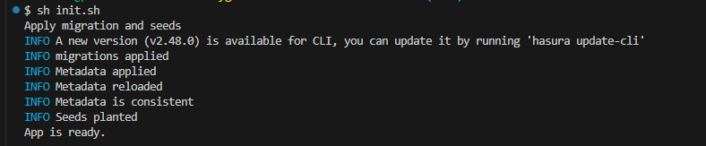

# Car service application

Repo for the exam task for the React course, Softuni October 2025

## Note! The application was built for educational purposes - a demonstration of what was learned from the REACT-Softuni 2025 course, and has absolutely basic functionality to demonstrate working with roles, tables, and CRUD operations, covering the exam assignment.

# Migrations and seeds


# React + TypeScript + Vite

This template provides a minimal setup to get React working in Vite with HMR and some ESLint rules.

Currently, two official plugins are available:

- [@vitejs/plugin-react](https://github.com/vitejs/vite-plugin-react/blob/main/packages/plugin-react) uses [Babel](https://babeljs.io/) (or [oxc](https://oxc.rs) when used in [rolldown-vite](https://vite.dev/guide/rolldown)) for Fast Refresh
- [@vitejs/plugin-react-swc](https://github.com/vitejs/vite-plugin-react/blob/main/packages/plugin-react-swc) uses [SWC](https://swc.rs/) for Fast Refresh

## React Compiler

The React Compiler is not enabled on this template because of its impact on dev & build performances. To add it, see [this documentation](https://react.dev/learn/react-compiler/installation).

## Expanding the ESLint configuration

If you are developing a production application, we recommend updating the configuration to enable type-aware lint rules:

```js
export default defineConfig([
  globalIgnores(['dist']),
  {
    files: ['**/*.{ts,tsx}'],
    extends: [
      // Other configs...

      // Remove tseslint.configs.recommended and replace with this
      tseslint.configs.recommendedTypeChecked,
      // Alternatively, use this for stricter rules
      tseslint.configs.strictTypeChecked,
      // Optionally, add this for stylistic rules
      tseslint.configs.stylisticTypeChecked,

      // Other configs...
    ],
    languageOptions: {
      parserOptions: {
        project: ['./tsconfig.node.json', './tsconfig.app.json'],
        tsconfigRootDir: import.meta.dirname,
      },
      // other options...
    },
  },
])
```

You can also install [eslint-plugin-react-x](https://github.com/Rel1cx/eslint-react/tree/main/packages/plugins/eslint-plugin-react-x) and [eslint-plugin-react-dom](https://github.com/Rel1cx/eslint-react/tree/main/packages/plugins/eslint-plugin-react-dom) for React-specific lint rules:

```js
// eslint.config.js
import reactX from 'eslint-plugin-react-x'
import reactDom from 'eslint-plugin-react-dom'

export default defineConfig([
  globalIgnores(['dist']),
  {
    files: ['**/*.{ts,tsx}'],
    extends: [
      // Other configs...
      // Enable lint rules for React
      reactX.configs['recommended-typescript'],
      // Enable lint rules for React DOM
      reactDom.configs.recommended,
    ],
    languageOptions: {
      parserOptions: {
        project: ['./tsconfig.node.json', './tsconfig.app.json'],
        tsconfigRootDir: import.meta.dirname,
      },
      // other options...
    },
  },
])
```


# Apollo + Hasura + PostgreSQL

CODEGEN: https://the-guild.dev/graphql/codegen/docs/guides/react-vue

@graphql-codegen/typescript-react-apollo
@apollo/client
<!-- 
# docker compose down
# docker compose up --build -d
 

cd .\graphql\
npx hasura migrate apply --database-name "default" 
npx hasura metadata apply
npx hasura seed apply --database-name "default"

 
 

npx hasura migrate squash --skip-update-check --database-name="default" --delete-source --name "vehicles_and_repair_requests_tables" --from 1762179464569 
npx hasura migrate apply --database-name "default"
npx hasura metadata export

https://the-guild.dev/graphql/codegen/plugins/typescript/typescript-react-apollo

	npm i -D @graphql-codegen/cli
	npm i -D @graphql-codegen/introspection
	npm i -D @graphql-codegen/time
	npm i -D @graphql-codegen/typescript
	npm i -D @graphql-codegen/typescript-operations
	npm i -D @graphql-codegen/typescript-react-apollo

  npm install @apollo/client graphql

-->