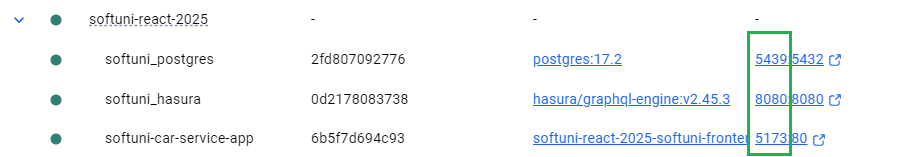
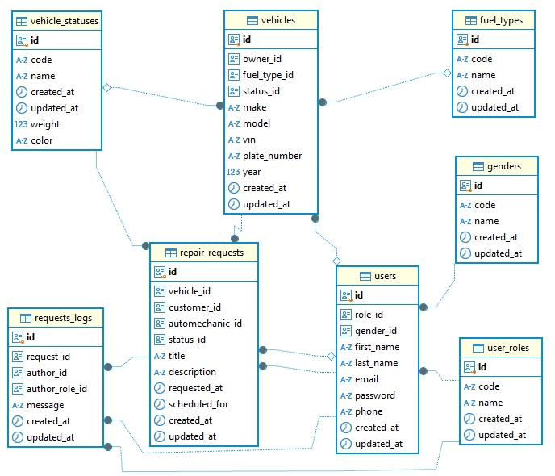
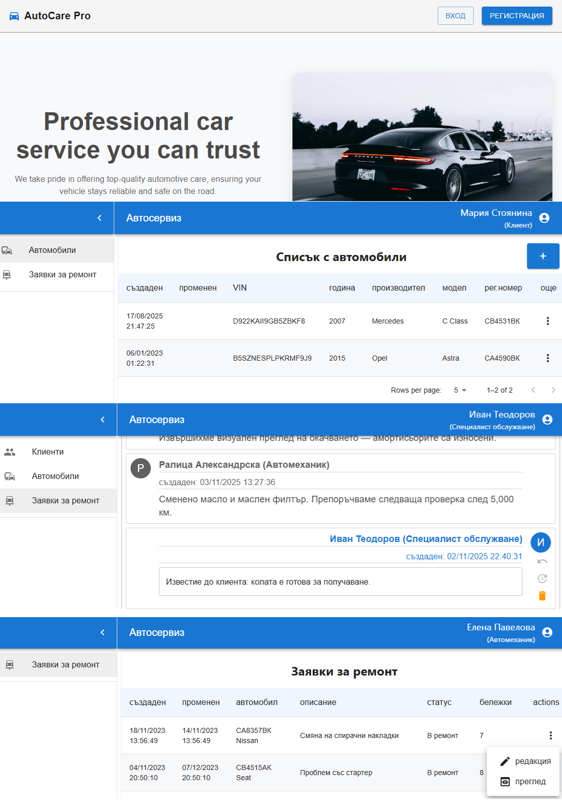

# Application for managing data for a Car service, including customers, Vehicles, and repair requests information with its associated comments.

## A repo for the exam task for the React course, Softuni, October 2025

## Tech stack


## Environment requirements:

- Node: v22.13.0
- Package Manager: npm 11.6.3
- Docker version: 28.3.2

## Installation

```bash
# bash

# clone repo
git clone https://github.com/peshoni/softuni-react-2025.git

# move to project directory
cd softuni-react-2025.git

# Install application
npm install

# Build the images and run them as containers
docker-compose up --build -d

# When containers are healthy, apply the migrations, metadata and seeds over the Hasura and Postgres
sh init.sh

# That's all!
```

## Stop the application

```bash
 docker compose down
```


## Exposed containers:

1. React application : localhost:5173
2. Hasura console: localhost:8080
3. Postgres: localhost:5439



### Note! If these ports are busy on your machine, you can edit them in the docker-compose file. Clear and Run containers again.

## Data model:



# Preview of pages for different roles with a 'mock' user data:

- serviceSpecialist: ivanteodorov@service.bg / Service123!  
- customer:          mariyastoyanina@service.bg / UserPass!
- autoMechanic:      elenapavelova@service.bg / Mechanic!
### All users data from the seeds can be found in file : https://github.com/peshoni/softuni-react-2025/blob/main/graphql/seeds/default/mock_car_service_data.sql


## Types scaffolding

Docs: https://the-guild.dev/graphql/codegen/docs/guides/react-vue

```bash
#for regeneration of types run:
npm run codegen
```


#### Note! The application was built for educational purposes - a demonstration of what was learned from the SoftUni course ReactJS-october-2025,  and has basic functionality to demonstrate working with roles, tables, and CRUD operations, covering the exam assignment. It also has conceptual issues and lacks security.

### Thanks for your attention.
